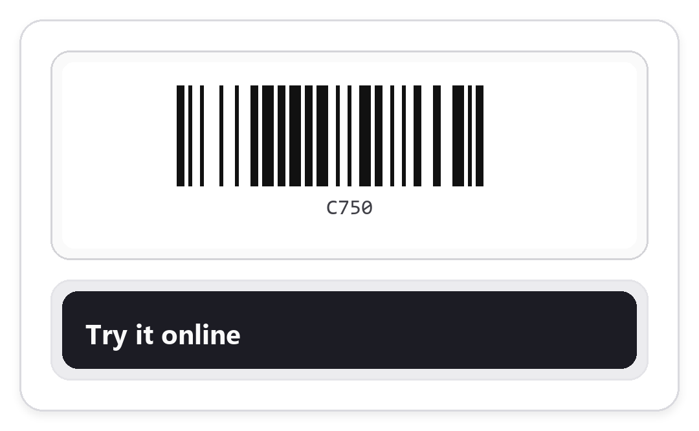

# Netum C750 Configurator

Scan a setting. That’s it.

No install. No driver. Open the file, pick an option, scan the barcode on screen.

  

  

---

### Pick a setting, scan the code

Keyboard language, USB, Bluetooth, sleep, prefixes, symbologies — 450+ commands from the official C750 manual.

  

### Build custom barcodes

Prefix, suffix, hide characters, replace GS, rename Bluetooth — one generated code instead of a dozen scans.

  

### See what the scanner types back

Firmware, battery, layout: the scanner talks like a keyboard. The right-hand panel catches it.
